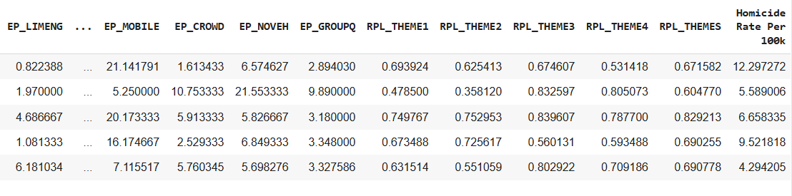
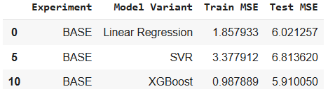
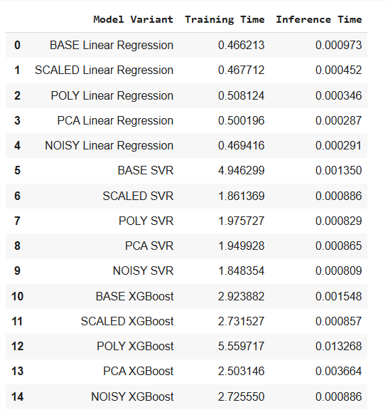
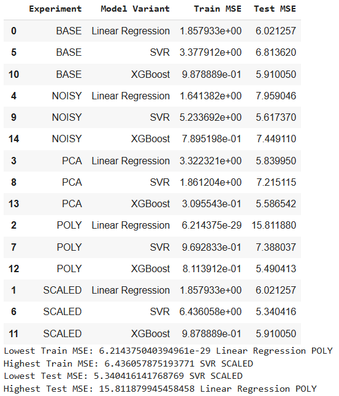

# Predicting U.S. Gun Homicide Rates Using Social Vulnerability Index
## Introduction
This project addresses the problem of predicting gun homicide rates in the United States using socioeconomic and demographic factors represented by the Social Vulnerability Index (SVI). Understanding the factors that contribute to gun violence is crucial for developing effective prevention strategies and resource allocation to mitigate this public health crisis. This project aims to explore the relationship between social vulnerability and gun homicide rates and identify potential predictive features for future analysis and intervention.

## Dataset
The dataset used in this project combines data both from the CDC: gun homicides per 100k capita data and SVI data. The SVI dataset includes features related to socioeconomic status, household characteristics, racial and ethnic minority status, and calculated SVI's for U.S counties.

### Structure
The dataset contains 18 determining features after preprocessing representing various social and economic factors, with the target variable being the gun homicide rate per 100,000 population for each state. Features represent estimated percentages of populations falling under a certain socioeconomic criteria. Documentation of these features is provided here: https://www.atsdr.cdc.gov/place-health/media/pdfs/2024/10/SVI2022Documentation.pdf

### Biases
The dataset may contain biases related to data collection and reporting practices. For example, gun homicide data may be underreported in some areas, leading to potential inaccuracies.  Additionally, the homicide rate per 100k varies widely (example: 1.28 in New Hampshire vs. 20.99 in D.C.), suggesting potential skewness. This could indicate imbalance if modeling homicide rates.

### Preprocessing
The following preprocessing steps were performed:

-Group county data by states, and performed aggregation via averaging

-Removed irrelevant columns (flags, extraneous state codes, margin of error values)

-Rows with unreliable homicide rates were manually calculated using Execl Formulae

-Only chose features that represented percentage of population rather than raw amounts

-Features starting with "RPL_" were separated as they represent different social vulnerability rankings scores (overall and for individual themes)

### Baseline Performance
Three models were trained and tuned to establish a baseline performance metric: Linear Regression, Support Vector Regression (SVR), and XGBoost. The models were evaluated using Mean Squared Error (MSE) and R-squared (R^2) on a test set (20% of the data). The results are summarized below:

## Experiments
### Scaling Features
Features were scaled using MinMaxScaler. This reduced training times for GridSearchCV, especially for XGBoost. MSE for SVR improved, and it chose a linear kernel instead of a polynomial one.

### Adding Features
Polynomial features of 2nd and 3rd order were generated. For 2nd order polynomials, XGBoost performed the best. However, using 3rd order polynomials improved SVR's testing error, making it the best model. XGBoost showed signs of overfitting in this scenario.

### Feature Transformations
PCA was applied to reduce dimensionality, capturing 90% of variance with 6 components. This lowered MSE for SVR and Linear Regression, but raised it for XGBoost.

### Preprocessing
Two variants of the dataset were proposed - one containing the features used to calculate the final SVI values, and the other containing only the SVI values themselves (features with the "_RPF" flags). It was found that the first dataset variant,
the one with the features, worked best for the models.

### Noisy Indicators
Synthetic noise (a random continuous and a random discrete categorical feature) was introduced. This experiment assessed the robustness of the models to irrelevant features. The impact on model performance varied.

## Results and Discussion

## Recommended Model
Based on the experiment results, the recommended model for predicting U.S. gun homicide rates is SVR with a linear kernel on MinMax scaled features. This model achieved the lowest Test MSE (5.693) compared to other model variants and effectively captured the general pattern in the data without excessive overfitting. The dataset appears to have a linear relationship between features and the target variable, making this model suitable.
