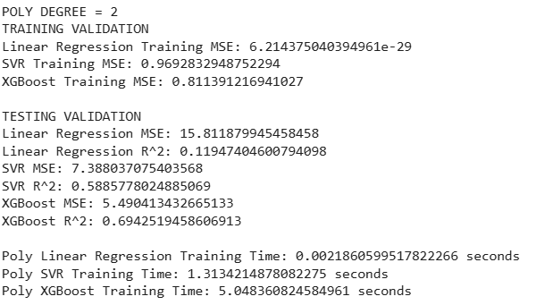
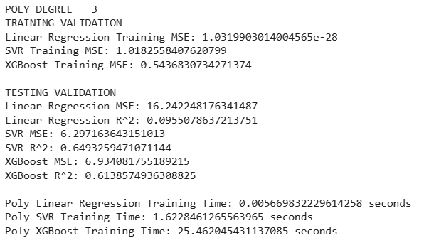

# Predicting U.S. Gun Homicide Rates Using Social Vulnerability Index
## Introduction
This project addresses the problem of predicting gun homicide rates in the United States using socioeconomic and demographic factors represented by the Social Vulnerability Index (SVI). Understanding the factors that contribute to gun violence is crucial for developing effective prevention strategies and resource allocation to mitigate this public health crisis. This project aims to explore the relationship between social vulnerability and gun homicide rates and identify potential predictive features for future analysis and intervention.

## Dataset
The dataset used in this project combines data both from the CDC: gun homicides per 100k capita data and SVI data. The SVI dataset includes indicating features related to socioeconomic status, household characteristics, racial and ethnic minority status, and calculated SVI scores for four themes (represented by the "RPL" flags), based on the indicating features. The SVI dataset reports on a county-level, while gun-homicide is on a state-level. Preporcessing was done to aggregate and group SVI county data into states. All data focuses on the year 2022. 

### Structure
The dataset contains 18 features representing various socioeconomic factors, with the target variable being the gun homicide rate per 100,000 population for each state. Features represent estimated percentages of populations falling under a certain socioeconomic criteria, as well as their raw value conterpart. For this project, only percentages will be used to better represent a population. Documentation of these features is provided here: https://www.atsdr.cdc.gov/place-health/media/pdfs/2024/10/SVI2022Documentation.pdf

### Biases
The dataset may contain biases related to data collection and reporting practices. For example, gun homicide data may be underreported in some areas, leading to potential inaccuracies.  Additionally, the homicide rate per 100k varies widely (example: 1.28 in New Hampshire vs. 20.99 in D.C.), suggesting potential skewness and data imbalance.

### Preprocessing
The following preprocessing steps were performed:

-Group county data by states, and performed aggregation via averaging

-Removed irrelevant columns (flags, extraneous state codes, margin of error values)

-Rows with unreliable homicide rates were manually calculated using Execl Formulae

-Only chose features that represented percentage of population rather than raw amounts

-Features starting with "RPL_" were separated as they represent different social vulnerability rankings scores (overall and for individual themes)

-To elimiate the presence of multicollinearity, only the indicating features will be considered for for the models - hence, I omit the social vulerability ranking scores. 

-Data was split between 20% testing and 80% training

### Baseline Performance
Three models were trained and tuned using GridSearchCV to establish a baseline performance metric: Linear Regression, Support Vector Regression (SVR), and XGBoost. The models were evaluated using Mean Squared Error (MSE) on a test set. All of the following experiments will use the same parameter grid establshed in the baseline. The results of the baseline training are summarized below:

## Experiments
### Scaling Features
Features were scaled using MinMaxScaler. This reduced training times significantly for all models. All models maintained the same MSEs except for SVR, which improved its testing errors and reduced overfitting.

### Adding Features
Polynomial features of 2nd and 3rd order were generated. The PolynomialFeatures function from SciKit was used to generate the features. 2nd order polynomials expanded the dataset to 152 features, while 3rd order expanded to 968.

For 2nd order polynomials, XGBoost performed the best, though took the longest to train. Linear regression noticeably performed the worst, while SVR performed decently. This suggests how SVR is better suited for handling data with high-dimensions because of its ability to regularize through adjusting its margin parameter. 

For 3rd order polynomials SVR improved its testing error, outperforming XGBoost - however, SVR still performs worse than XGBoost when using two degrees. XGBoost showed signs of overfitting in this scenario.

### Feature Transformations
PCA was applied to reduce dimensionality, set to capture 90% of variance with 6 components - 90% was found to consistently provide the best overall performance. This lowered MSE for XGBoost and Linear Regression, but raised it for SVR. This suggests PCA may have discarded important features crucial to the SVR model. This also supports the previous finding of how SVR excels in high-dimensional data.

### Preprocessing
Two variants of the dataset were proposed - one containing the features used to calculate the final SVI values, and the other containing only the SVI values themselves (features with the "RPL" flags). It was found that the first dataset variant, the one with the indicating features, worked best for the models. Including the SVI index scores in the dataset introduces multicollinearity.

### Noisy Indicators
Synthetic noise (a random continuous and a random discrete categorical feature) was introduced to the dataset, assessing the robustness of the models to irrelevant features. It was found that SVR with a linear kernel achieved the lowest MSE out of all the experiments. Introducing noisy data appears to worsen the MSE of XGBoost by inducing overfitting, as seen by the significantly lowered training error but heighted testing error. On the otherhand, linear SVR increased in training error but lowered in in testing error, indicating a reduction in overfitting.

## Results and Discussion

It appears that SVR with a linear kernel on noisy features achieved the lowest testing MSE compared to other model variants. This implies that noisy data may reduce overfitting for linear based models, but increase overfitting in tree-based boosting models like XGBoost - especially in the case of small datasets such as the one used in this project. Adding noise can artificially increase the diversity of the data, providing the model with more variations to learn from and potentially improving generalization.

If more time, and patience, were available, a more extensive GridSearch over a wider range of values could potentially yield better results, especially for XGBoost which tended to overfit the relatively small data. Using techniques like RandomizedSearchCV or Bayesian Optimization would alternatively allow for a more efficient exploration of the hyperparameter space.

It was also apparent that overfitting was a prevalent issue within the models, due to the small sample size (51 samples) in the dataset. To improve overfitting issues, it may be better to incorporate more data from additional years, or elect to analyze county data.

Experimenting with other models, particularly Ensemble Methods could potentially improve overall accuracy and stability.

## Recommended Model
Based on the experiment results, the recommended model for predicting U.S. gun homicide rates is SVR with a linear kernel on noisy and scaled features achieved the lowest MSE compared to other model variants - therefore, this is my recomended model for the given dataset. This model effectively captured the general pattern within the dataset without excessive overfitting, leading to improved predictive performance.

